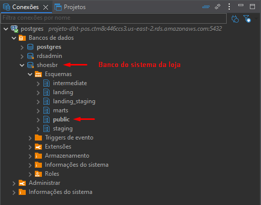
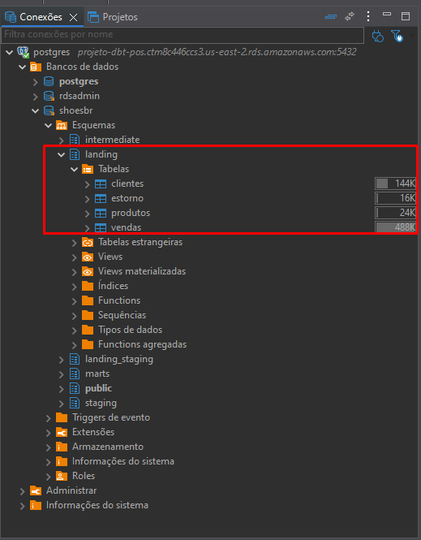
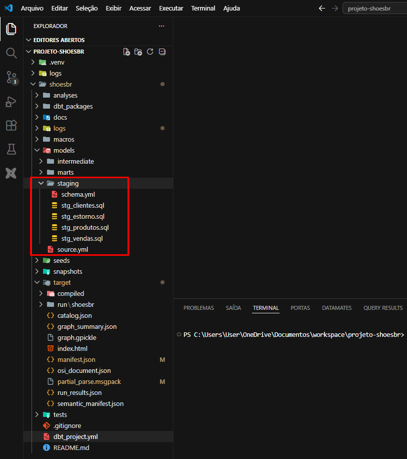
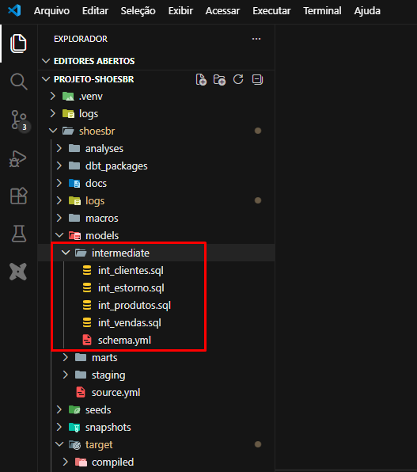
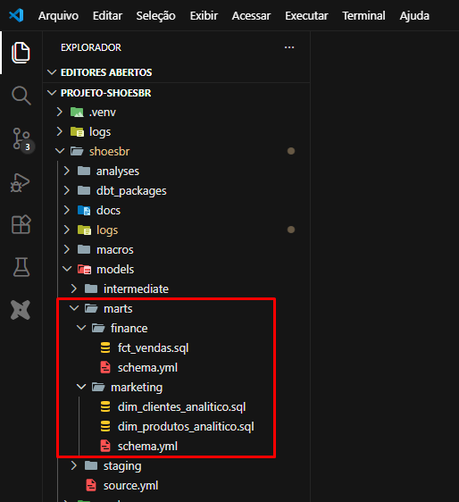
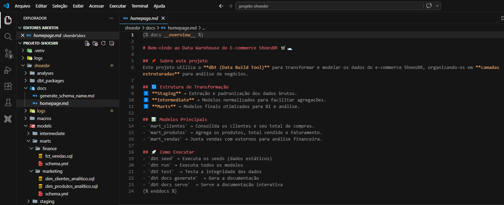
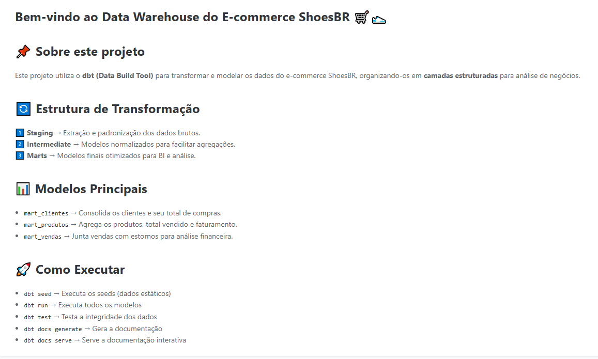

# 📊 Projeto ShoesBR com dbt Core

Pipeline analítico construído com **PostgreSQL**, **dbt Core** e **dbt Cloud**, aplicando conceitos modernos de **Analytics Engineering**, modelagem de dados e transformação em camadas.

Este projeto demonstra na prática a construção de um ambiente analítico completo utilizando versionamento com GitHub, documentação automatizada, testes de qualidade e Data Lineage através do dbt.

---

# 🎯 Objetivo

Construir um pipeline analítico organizado em camadas, transformando dados operacionais em informações confiáveis para consumo por dashboards, relatórios e análises de negócio.

---

# 🚀 Tecnologias Utilizadas

* Python
* PostgreSQL
* AWS RDS
* dbt Core
* dbt Cloud
* SQL
* Git
* GitHub
* VS Code
* DBeaver

---

# 📦 Arquitetura do Pipeline

O projeto segue uma arquitetura em camadas amplamente utilizada em Analytics Engineering.

```text
PostgreSQL
│
├── public (Fonte Transacional Simulada)
│
▼
Landing (Dados Brutos / Bronze)
│
▼
Staging (Limpeza e Padronização / Silver)
│
▼
Intermediate (Regras de Negócio / Silver)
│
▼
Marts (Consumo Analítico / Gold)
│
▼
Dashboards / Relatórios
```

---

# 🖼️ Arquitetura da Solução

> Inserir aqui uma imagem da arquitetura do pipeline.

```markdown

```

---

# 📥 Fonte de Dados

Os dados de origem estão armazenados no schema:

```sql
public
```

Este schema simula um ambiente transacional contendo informações operacionais utilizadas como entrada para o pipeline analítico.

Exemplos:

* customers
* orders
* products
* categories



---

# 🧱 Camadas do Projeto

## 📥 Landing

Responsável por armazenar uma cópia dos dados de origem.

Objetivos:

* Preservar dados brutos
* Garantir rastreabilidade
* Facilitar auditorias



---

## 🧹 Staging

Responsável pela limpeza e padronização dos dados.

Principais transformações:

* Padronização de nomes
* Conversão de tipos
* Tratamento de nulos
* Correção de inconsistências

Modelos:

```text
stg_customers
stg_orders
stg_products
```



---

## ⚙️ Intermediate

Camada responsável pelas regras de negócio.

Principais atividades:

* JOIN entre tabelas
* Consolidação de informações
* Criação de métricas
* Reutilização de lógica

Modelos:

```text
int_customer_orders
int_sales_metrics
```



---

## 📊 Marts

Camada final do pipeline.

Responsável por disponibilizar dados prontos para consumo analítico.

Modelos:

```text
mart_sales
mart_customers
mart_products
```

Consumidores:

* Power BI
* Excel
* Tableau
* Analistas de Dados
* Cientistas de Dados



---

# ☁️ Fluxo das Ferramentas

```text
VS Code
   │
   ▼
Git
   │
   ▼
GitHub
   │
   ▼
dbt Cloud
   │
   ▼
PostgreSQL (AWS RDS)
```

---

# 🔍 Qualidade dos Dados

O projeto utiliza testes nativos do dbt para validação dos dados.

Testes aplicados:

* Not Null
* Unique
* Relationships

Benefícios:

* Maior confiabilidade dos dados
* Identificação precoce de falhas
* Garantia da qualidade analítica

---

# 📖 Documentação Automatizada

O dbt permite gerar documentação automaticamente a partir dos modelos e arquivos YAML.

Comandos utilizados:

```bash
dbt docs generate
```

```bash
dbt docs serve
```

A documentação inclui:

* Modelos
* Colunas
* Dependências
* Descrições
* Data Lineage




---

# 🔗 Data Lineage

Uma das principais funcionalidades do dbt é a visualização automática da linhagem dos dados.

```text
public.orders
      │
      ▼
landing.orders
      │
      ▼
stg_orders
      │
      ▼
int_sales
      │
      ▼
mart_sales
```

Benefícios:

* Governança
* Rastreabilidade
* Análise de impacto
* Facilidade de manutenção

---

# 📂 Estrutura do Projeto

```text
projeto-shoesbr/
│
├── analyses/
├── docs/
├── logs/
├── macros/
│
├── models/
│   ├── staging/
│   ├── intermediate/
│   └── marts/
│
├── seeds/
├── snapshots/
├── tests/
│
├── target/
│
├── dbt_project.yml
├── README.md
└── .gitignore
```

---

# 📚 Conceitos Aplicados

* Analytics Engineering
* Engenharia de Dados
* PostgreSQL
* SQL
* dbt Core
* dbt Cloud
* AWS RDS
* Data Modeling
* Data Lineage
* Data Quality
* Data Governance
* Git/GitHub

---

# 🎓 Aprendizados

Durante o desenvolvimento deste projeto foram praticados conceitos amplamente utilizados em ambientes corporativos:

* Construção de pipelines analíticos
* Modelagem de dados com dbt
* Integração GitHub + dbt Cloud
* Organização de modelos em camadas
* Testes automatizados
* Governança de dados
* Documentação técnica

---

# 📌 Conclusão

Este projeto demonstra a construção de um pipeline analítico moderno utilizando PostgreSQL, dbt Core e dbt Cloud, aplicando boas práticas de Analytics Engineering para transformar dados operacionais em informações confiáveis e prontas para consumo analítico.

A arquitetura em camadas (**Landing → Staging → Intermediate → Marts**) proporciona organização, escalabilidade, reutilização de código e governança dos dados.

---

## ⭐ Principais Diferenciais

✅ PostgreSQL hospedado na AWS RDS

✅ Integração GitHub + dbt Cloud

✅ Arquitetura em camadas

✅ Testes automatizados com dbt

✅ Data Lineage

✅ Documentação automatizada

✅ Boas práticas de Analytics Engineering
